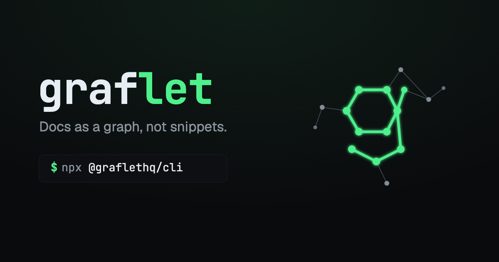

<p align="center">
  <a href="https://graflet.rnui.dev">
    
  </a>
</p>

<p align="center">
  <a href="https://www.npmjs.com/package/@graflethq/cli"></a>
  <a href="https://pypi.org/project/graflet/"></a>
  
  <a href="https://graflet.rnui.dev"></a>
  <a href="https://x.com/graflethq"></a>
</p>

**Docs as a graph, not snippets.**

Precomputed knowledge graphs of versioned library docs, for AI coding agents. One graflet = one
library at one release.

<!-- demo-gif: terminal recording of `graflet next.js` goes here once the catalog is populated -->

> **Pre-release.** The CLI is code-complete but **not published yet**, and the catalog is empty. The
> packages on [npm](https://www.npmjs.com/package/@graflethq/cli) and
> [PyPI](https://pypi.org/project/graflet/) are name-lock placeholders — installing one today gets
> you a stub, not the tool. Watch this repo (Watch → Custom → Releases) to hear when the real one
> lands.

## The problem

An AI coding agent that needs a library's documentation hits two failure modes:

1. **It reads docs as flat text.** Pages arrive as prose or snippets, so the agent re-reads whole
   files to answer a question about how two APIs relate, burning thousands of tokens rediscovering
   structure that was in the docs all along.
2. **It reads the wrong version.** Whatever is on `main` today is not the release the developer
   actually installed. The agent confidently writes v16 code against a v15 project.

One root cause: **documentation is shipped as text, unversioned at the point of use.** Graflet ships
it as a graph, keyed to a commit.

## What it does

```bash
graflet next.js        # the latest tracked release
graflet next.js@16     # that release, pinned forever
```

A slug is the library's GitHub repo name. One command, one directory (`./next.js/`, or
`./next.js@16/` when a version is given):

| File | What it is |
|---|---|
| `graph.json` | the knowledge graph — nodes, edges, communities |
| `graph.html` | the same graph, browsable in a browser (omitted when a graph is too large to render) |
| `GRAPH_REPORT.md` | a written summary of the graph |
| `savings.json` | build cost, graph size, and quality metrics for this build |
| `meta.json` | the pin: `repo_url`, `sha`, `version_label`, `nodes`, `edges`, `built_at` |
| `LICENSE*` | the upstream license file under upstream's own name (`LICENSE`, `LICENSE.md`, `NOTICE`, …), when the repo ships one |
| `<docs-path>/**` | the library's own documentation Markdown, byte-for-byte from upstream, at the path it lives at upstream |

## How it works

Two sources, one commit:

```
  graflet next.js
        |
        v
  catalog  ->  { repo_url, sha, docs_path, kg_ref }   <- one commit SHA pins both halves
        |
        +-------------------------------+
        |                               |
        v                               v
  codeload.github.com            api.graflet.rnui.dev
  anonymous, no token            GitHub sign-in required
  upstream repo @ SHA            broker holds the private-repo token
        |                               |
        v                               v
  ./next.js/docs/**              ./next.js/graph.json, graph.html,
                                         GRAPH_REPORT.md, savings.json
```

The Markdown comes from the library's **own public repo**, as a single anonymous codeload tarball at
a pinned commit SHA — no token, no API budget spent. The CLI never redistributes a library's docs;
it fetches them from the source. The knowledge graph comes from a Cloudflare Worker that verifies
your GitHub identity and streams the bytes out of a private repo; **you never hold a token for that
repo**. The graph was built from the same SHA the Markdown is fetched at, and the CLI refuses to
write anything if the broker reports a different SHA than the catalog did.

**Version is document identity.** A graph is keyed by `(repo, commit SHA)` and frozen forever.
`latest` is a moving label, never an identity; when a new release is tracked, the old graph stays
downloadable instead of being mutated in place. See
[ADR-0003](docs/adr/0003-version-as-document-identity.md) and
[ADR-0002](docs/adr/0002-two-source-delivery-pinned-by-sha.md).

**License-checked corpus.** Only docs under a license that permits commercial redistribution enter
the catalog, and a bundle carries the upstream license file alongside the graph whenever the repo
keeps one at its root.

## Free, and what that means

- Installing the CLI, browsing the catalog, and copying a command need **no account**.
- **One gate:** downloading a knowledge graph requires signing in with GitHub — the graph lives in a
  private repo and needs a broker. Sign-ins also grow a mailing list; that is a side-effect of the
  gate, not a reason to add friction anywhere else.
- **No paid plans in v1, and no paywalled tier today.** Paid offerings are a deferred phase-2
  decision, not something already built behind a flag. See
  [ADR-0005](docs/adr/0005-gate-and-free-oss-model.md).

If it is useful to you: star the repo, or tell someone who is losing tokens to documentation.
(GitHub Sponsors is not open yet.)

## Current state

| Piece | State |
|---|---|
| Website — catalog, copy-command, GitHub signup, legal pages | shipped, live at [graflet.rnui.dev](https://graflet.rnui.dev) |
| Backend — OAuth, catalog API, download broker, watch subscriptions + notification email | shipped, Cloudflare Worker at `api.graflet.rnui.dev` |
| CLI — `login` / `logout`, `<slug>` download, `watch` | code-complete, **not published yet** |
| Launch catalog of knowledge graphs | **in build** — the catalog API currently returns zero docs |
| Release poller | not built — until it ships, nothing triggers a watch notification |
| npm `@graflethq/cli` + PyPI `graflet` | name-lock **placeholders**; the real CLI replaces them |

## Repo layout

Each directory is self-contained — its own `package.json` and `node_modules`, no root workspace.
See [ADR-0008](docs/adr/0008-repo-layout-apps-packages.md).

| Path | What it is |
|---|---|
| `packages/cli/` | the `graflet` CLI (TypeScript) |
| `apps/web/` | the site — Next.js on Cloudflare via OpenNext |
| `apps/backend/` | the API — Cloudflare Worker: GitHub auth, catalog, KG broker |
| `packages/graflet-npm/`, `packages/graflet-pypi/` | registry name-lock stubs |
| `kg-pipeline/` | the graph build pipeline — **private submodule**, not part of the open-source surface |
| `assets/brand/` | logo, banner, OG image, favicons |
| `docs/adr/` | architecture decision records |

Three submodules (`kg-pipeline`, `kg-product-research`, `kg-data`) are private. Plain
`git clone` is the supported path; `--recurse-submodules` will fail.

## Docs

- [`CONTEXT.md`](CONTEXT.md) — what the product is and why, plus the glossary
- [`docs/adr/`](docs/adr/) — the decisions, one file each
- [`CLAUDE.md`](CLAUDE.md) — repo conventions and the full layout map

## Naming

Spelled **g-r-a-f-l-e-t**, no p-h. From *graphlet*, a real graph-theory term for a small induced
subgraph.

npm blocks the bare name `graflet` (its typosquat filter reads it as too close to `leaflet`), so the
npm package is scoped **`@graflethq/cli`** while PyPI keeps bare **`graflet`**. The installed command
is `graflet` on both. See [ADR-0007](docs/adr/0007-product-name-graflet.md).

## License

MIT — see [LICENSE](LICENSE).
